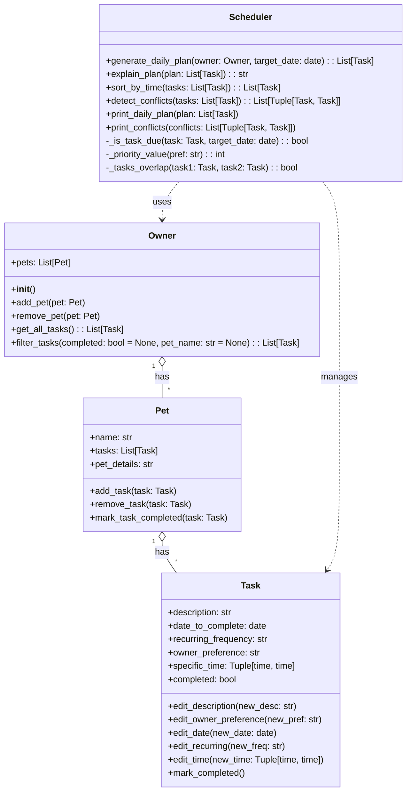
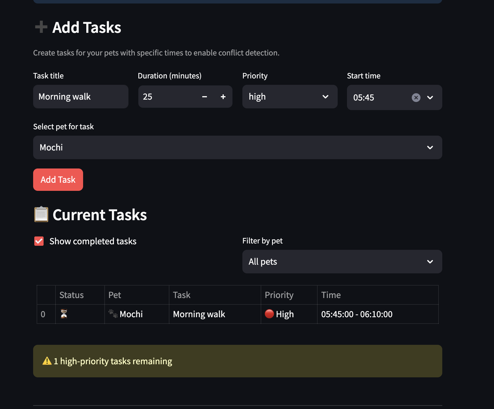

# PawPal+ (Module 2 Project)

You are building **PawPal+**, a Streamlit app that helps a pet owner plan care tasks for their pet.

## Scenario

A busy pet owner needs help staying consistent with pet care. They want an assistant that can:

- Track pet care tasks (walks, feeding, meds, enrichment, grooming, etc.)
- Consider constraints (time available, priority, owner preferences)
- Produce a daily plan and explain why it chose that plan

Your job is to design the system first (UML), then implement the logic in Python, then connect it to the Streamlit UI.

## Features

This implementation includes sophisticated algorithms for intelligent pet care scheduling:

### 🧠 **Core Scheduling Algorithms**

- **Priority-Based Sorting**: Tasks sorted by owner preference (high → medium → low) with time-based secondary sorting
- **Time-Based Sorting**: Alternative chronological sorting for time-focused views
- **Recurrence Logic**: Automatic creation of next occurrences for daily, weekly, and monthly recurring tasks
- **Conflict Detection**: O(n log n) algorithm detecting overlapping time windows between tasks
- **Task Filtering**: Multi-criteria filtering by completion status and pet assignment

### 🔧 **Supporting Algorithms**

- **Due Date Calculation**: Determines if recurring tasks are due on target dates
- **Time Window Overlap**: Interval overlap detection using standard [a,b] ∩ [c,d] algorithm
- **Priority Mapping**: String-to-numeric conversion for efficient sorting operations

## Updated UML Diagram



### Key Changes from Initial Design:

1. **Task Class:**
   - `priority_level: int` → `owner_preference: str` ("high", "medium", "low")
   - `specific_time: time` → `specific_time: Tuple[time, time]` (start/end times)
   - Added `completed: bool` attribute and `mark_completed()` method

2. **Pet Class:**
   - Added `name: str` and `pet_details: str` attributes
   - Added `mark_task_completed()` for handling recurring tasks

3. **Owner Class:**
   - Added `get_all_tasks()` and `filter_tasks()` methods for task management

4. **Scheduler Class:**
   - Expanded from 2 to 8 methods including conflict detection, time sorting, and helper functions

## Smarter Scheduling

This implementation includes advanced scheduling features that go beyond basic task management:

### 🔄 **Automatic Recurring Tasks**
- Daily and weekly recurring tasks automatically create next occurrences when completed
- No manual rescheduling required for routine pet care

### ⚡ **Intelligent Conflict Detection**
- Detects overlapping time windows between tasks
- Provides clear warnings without preventing scheduling
- Optimized O(n log n) algorithm for performance

### 🔍 **Flexible Task Filtering**
- Filter tasks by completion status (completed/incomplete)
- Filter by specific pet names
- Combine filters for precise task queries

### ⏰ **Multiple Sorting Options**
- Priority-based sorting (high → medium → low, then by time)
- Time-based sorting for chronological views
- Customizable display options

### 📊 **Comprehensive Testing**
- 23 unit tests covering all major functionality
- Edge case handling and algorithmic validation

## 📸 Demo

### Running the App

To see PawPal+ in action, run:

```bash
streamlit run app.py
```

Then open http://localhost:8501 in your browser.

### App Screenshots



*The screenshot shows the complete PawPal+ interface with pet management, task creation, filtering options, and schedule generation with conflict detection.*

### App Interface Overview

- **Pet Management Section**: Form to add pets with name and species
- **Task Creation**: Multi-column form with task title, duration, priority, and start time
- **Task Overview**: Filtered table showing all tasks with status icons, pet assignments, and time slots
- **Schedule Generation**: Radio buttons for sorting options and primary "Generate schedule" button
- **Conflict Detection**: Warning messages when tasks have overlapping time slots
- **Schedule Display**: Professional table showing prioritized task list with visual conflict indicators

### Key UI Features Demonstrated

- **Responsive Design**: Multi-column layouts that adapt to different screen sizes
- **Interactive Filtering**: Checkbox and dropdown controls for task filtering
- **Visual Feedback**: Success messages, warnings, and status icons throughout
- **Professional Styling**: Clean tables, appropriate button types, and helpful tooltips

---

## Testing PawPal+

### Running Tests

To run the test suite, use the following command:

```bash
python -m pytest
```

### Test Coverage

The test suite covers critical PawPal+ functionality including:
- Task creation, editing, and completion
- Recurring task logic (daily, weekly, monthly)
- Priority-based and chronological sorting
- Conflict detection for overlapping time slots
- Task filtering by completion status and pet name
- Daily plan generation and explanation

### Confidence Level

⭐⭐⭐⭐⭐ (5/5 stars) - All 23 tests pass, providing high confidence in system reliability for core scheduling features.

## Getting started

### Setup

```bash
python -m venv .venv
source .venv/bin/activate  # Windows: .venv\Scripts\activate
pip install -r requirements.txt
```

### Suggested workflow

1. Read the scenario carefully and identify requirements and edge cases.
2. Draft a UML diagram (classes, attributes, methods, relationships).
3. Convert UML into Python class stubs (no logic yet).
4. Implement scheduling logic in small increments.
5. Add tests to verify key behaviors.
6. Connect your logic to the Streamlit UI in `app.py`.
7. Refine UML so it matches what you actually built.
